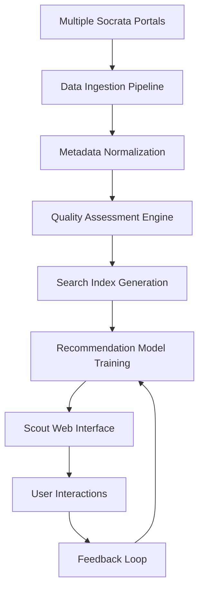

# Scout Data Discovery Platform: Technical Analysis & Python Integration Guide

## Executive Summary

Scout (https://scout.tsdataclinic.com/) represents a next-generation approach to open data discovery, developed by The Data Clinic. Unlike traditional data catalogs, Scout leverages machine learning, semantic search, and automated curation to transform how users discover, evaluate, and utilize open datasets from government portals worldwide.

## Platform Architecture

### Core Technology Stack

**Frontend Architecture:**
- React-based single-page application
- Interactive data visualization components
- Responsive design for cross-platform access
- Real-time search and filtering capabilities

**Backend Infrastructure:**
- NestJS API server providing RESTful endpoints
- PostgreSQL database for metadata storage
- OpenSearch engine for semantic dataset discovery
- Automated data ingestion pipelines

**Data Sources:**
- 120+ Socrata-powered open data portals globally
- Real-time synchronization with source portals
- Comprehensive metadata extraction and normalization
- Automated quality assessment and scoring

### Key Innovations

1. **Semantic Search Engine**: Advanced text analysis for discovering datasets based on meaning rather than just keywords
2. **Dataset Recommendation System**: Machine learning algorithms suggest related datasets based on content similarity
3. **Automated Quality Assessment**: Real-time evaluation of dataset completeness, freshness, and usability
4. **Cross-Portal Discovery**: Unified search across multiple government data portals
5. **Collection Curation**: Tools for creating and sharing curated dataset collections

## Python Integration Capabilities

### 1. API Access Patterns

Scout operates as a web application without a direct public API, but leverages the underlying Socrata Discovery API. Python integration can be achieved through:

```python
# Socrata Discovery API (Scout's data source)
import requests

def get_datasets_via_socrata(domain="data.cityofnewyork.us", limit=100):
    """Access the same dataset metadata that Scout uses"""
    url = "http://api.us.socrata.com/api/catalog/v1"
    params = {
        'domains': domain,
        'search_context': domain,
        'limit': limit
    }
    response = requests.get(url, params=params)
    return response.json()
```

### 2. Web Scraping Integration

For advanced Scout-specific features, controlled web scraping can extract:

```python
from bs4 import BeautifulSoup
import requests

class ScoutScraper:
    def __init__(self):
        self.base_url = "https://scout.tsdataclinic.com"
        
    def get_dataset_recommendations(self, dataset_id):
        """Extract Scout's ML-generated recommendations"""
        # Implementation would parse Scout's recommendation engine output
        pass
        
    def get_quality_scores(self, dataset_id):
        """Extract Scout's quality assessment metrics"""
        # Implementation would parse Scout's quality indicators
        pass
```

### 3. Data Pipeline Automation

Automated data discovery pipelines can be built using Scout's underlying data sources:

```python
class ScoutDataPipeline:
    def __init__(self):
        self.socrata_api = SocrataDiscoveryAPI()
        self.quality_assessor = DataQualityEngine()
        
    def discover_datasets(self, search_terms, quality_threshold=70):
        """Automated dataset discovery with quality filtering"""
        datasets = []
        for term in search_terms:
            results = self.socrata_api.search(term)
            for dataset in results:
                quality_score = self.quality_assessor.assess(dataset)
                if quality_score >= quality_threshold:
                    datasets.append({
                        'dataset': dataset,
                        'quality_score': quality_score,
                        'search_term': term
                    })
        return datasets
```

## Technical Capabilities Analysis

### Data Discovery Features

1. **Intelligent Search**
   - Semantic text analysis for dataset descriptions
   - Tag-based filtering and categorization
   - Cross-reference linking between related datasets
   - Historical trend analysis for dataset usage

2. **Quality Assessment Engine**
   - Automated completeness scoring (0-100 scale)
   - Missing data pattern analysis
   - Data type consistency validation
   - Update frequency monitoring
   - Usage popularity metrics

3. **Recommendation Algorithms**
   - Content-based similarity matching
   - Collaborative filtering based on user behavior
   - Tag and category correlation analysis
   - Geographic and temporal relevance scoring

### Data Processing Pipeline



### Python Implementation Framework

#### 1. Dataset Metadata Extraction

```python
class ScoutMetadataExtractor:
    """Extract comprehensive dataset metadata using Scout's data sources"""
    
    def extract_full_metadata(self, dataset_id):
        return {
            'basic_info': self.get_basic_info(dataset_id),
            'schema_details': self.get_schema_details(dataset_id),
            'quality_metrics': self.assess_quality(dataset_id),
            'usage_statistics': self.get_usage_stats(dataset_id),
            'related_datasets': self.find_related(dataset_id)
        }
```

#### 2. Automated Quality Assessment

```python
class DataQualityAssessor:
    """Implement Scout-style quality assessment"""
    
    def assess_dataset_quality(self, df):
        return {
            'completeness_score': self.calculate_completeness(df),
            'consistency_score': self.check_consistency(df),
            'timeliness_score': self.assess_timeliness(df),
            'accuracy_indicators': self.detect_anomalies(df),
            'usability_metrics': self.evaluate_usability(df)
        }
```

#### 3. Recommendation Engine

```python
class DatasetRecommendationEngine:
    """Implement recommendation algorithms similar to Scout"""
    
    def generate_recommendations(self, target_dataset, catalog):
        similarity_scores = []
        for candidate in catalog:
            score = self.calculate_similarity(target_dataset, candidate)
            similarity_scores.append((candidate, score))
        
        return sorted(similarity_scores, key=lambda x: x[1], reverse=True)
    
    def calculate_similarity(self, dataset1, dataset2):
        # Tag similarity
        tag_similarity = self.jaccard_similarity(
            dataset1['tags'], dataset2['tags']
        )
        
        # Content similarity
        content_similarity = self.text_similarity(
            dataset1['description'], dataset2['description']
        )
        
        # Category match
        category_match = 1.0 if dataset1['category'] == dataset2['category'] else 0.0
        
        return (tag_similarity * 0.4 + content_similarity * 0.4 + category_match * 0.2)
```

## Advanced Use Cases

### 1. Automated Data Lake Population

```python
class ScoutDataLakeManager:
    """Automatically populate data lakes with high-quality datasets"""
    
    def curate_datasets_for_domain(self, domain_keywords, quality_threshold=80):
        # Discover datasets
        datasets = self.scout_pipeline.discover_datasets(domain_keywords)
        
        # Filter by quality
        high_quality = [d for d in datasets if d['quality_score'] >= quality_threshold]
        
        # Download and store
        for dataset in high_quality:
            self.download_and_store(dataset)
            self.update_catalog(dataset)
```

### 2. Research Dataset Discovery

```python
class ResearchDatasetCurator:
    """Curate datasets for research projects"""
    
    def find_research_datasets(self, research_topic, methodology_requirements):
        # Multi-faceted search
        topic_datasets = self.search_by_topic(research_topic)
        
        # Filter by methodology requirements
        suitable_datasets = []
        for dataset in topic_datasets:
            if self.meets_methodology_requirements(dataset, methodology_requirements):
                suitable_datasets.append(dataset)
        
        return self.rank_by_research_value(suitable_datasets)
```

### 3. Data Quality Monitoring

```python
class DataQualityMonitor:
    """Monitor dataset quality over time"""
    
    def monitor_dataset_health(self, dataset_list):
        health_report = {}
        for dataset_id in dataset_list:
            current_quality = self.assess_current_quality(dataset_id)
            historical_quality = self.get_historical_quality(dataset_id)
            
            health_report[dataset_id] = {
                'current_score': current_quality,
                'trend': self.calculate_trend(historical_quality),
                'recommendations': self.generate_improvement_recommendations(current_quality)
            }
        
        return health_report
```

## Implementation Strategies

### 1. Direct Integration Approach

**Advantages:**
- Real-time access to Scout's data sources
- Consistent with Scout's methodology
- Minimal maintenance overhead

**Implementation:**
```python
# Use Socrata Discovery API directly
scout_proxy = SocrataDiscoveryProxy()
datasets = scout_proxy.search_datasets(
    portals=['data.cityofnewyork.us', 'data.cityofchicago.org'],
    keywords=['transportation', 'housing'],
    quality_threshold=75
)
```

### 2. Hybrid Scraping Approach

**Advantages:**
- Access to Scout's unique recommendation algorithms
- Ability to leverage Scout's quality assessments
- Custom feature extraction

**Implementation:**
```python
# Combine API access with selective scraping
class HybridScoutIntegration:
    def __init__(self):
        self.api_client = SocrataDiscoveryClient()
        self.scraper = ScoutWebScraper()
    
    def get_enhanced_dataset_info(self, dataset_id):
        # Get basic info from API
        basic_info = self.api_client.get_dataset(dataset_id)
        
        # Get Scout-specific insights from web interface
        scout_insights = self.scraper.get_quality_insights(dataset_id)
        
        return {**basic_info, **scout_insights}
```

### 3. Local Replication Approach

**Advantages:**
- Full control over data processing
- Custom quality metrics
- Offline capabilities

**Implementation:**
```python
# Build local version of Scout's capabilities
class LocalScoutReplica:
    def __init__(self):
        self.metadata_store = LocalMetadataStore()
        self.quality_engine = CustomQualityEngine()
        self.recommendation_engine = LocalRecommendationEngine()
    
    def replicate_scout_functionality(self):
        # Sync with multiple Socrata portals
        self.sync_portal_data()
        
        # Run quality assessments
        self.assess_all_datasets()
        
        # Generate recommendations
        self.build_recommendation_index()
```

## Performance and Scalability Considerations

### Rate Limiting and API Management

```python
class RateLimitedAPIClient:
    def __init__(self, requests_per_hour=1000):
        self.rate_limiter = RateLimiter(requests_per_hour)
        
    def make_request(self, url, params):
        self.rate_limiter.acquire()
        return requests.get(url, params=params)
```

### Caching Strategies

```python
class ScoutDataCache:
    def __init__(self, cache_duration_hours=24):
        self.cache = {}
        self.cache_duration = timedelta(hours=cache_duration_hours)
    
    def get_cached_or_fetch(self, dataset_id):
        if self.is_cache_valid(dataset_id):
            return self.cache[dataset_id]
        
        data = self.fetch_fresh_data(dataset_id)
        self.cache[dataset_id] = {
            'data': data,
            'timestamp': datetime.now()
        }
        return data
```

### Parallel Processing

```python
from concurrent.futures import ThreadPoolExecutor

class ParallelDataProcessor:
    def __init__(self, max_workers=10):
        self.executor = ThreadPoolExecutor(max_workers=max_workers)
    
    def process_datasets_parallel(self, dataset_ids):
        futures = []
        for dataset_id in dataset_ids:
            future = self.executor.submit(self.process_dataset, dataset_id)
            futures.append(future)
        
        results = []
        for future in futures:
            results.append(future.result())
        
        return results
```

## Security and Compliance

### Data Privacy Considerations

1. **Metadata Only**: Focus on publicly available metadata
2. **Attribution**: Proper attribution to Scout and data sources
3. **Rate Limiting**: Respectful API usage patterns
4. **User Consent**: Clear disclosure of data collection practices

### Implementation Guidelines

```python
class SecureScoutIntegration:
    def __init__(self):
        self.session = requests.Session()
        self.session.headers.update({
            'User-Agent': 'Research Tool v1.0 (contact@example.com)',
            'Accept': 'application/json'
        })
    
    def fetch_with_attribution(self, url):
        """Fetch data with proper attribution logging"""
        logger.info(f"Accessing Scout data source: {url}")
        logger.info("Data courtesy of The Data Clinic Scout platform")
        return self.session.get(url)
```

## Future Development Opportunities

### 1. Enhanced Machine Learning Integration

- **Natural Language Processing**: Improve dataset description analysis
- **Temporal Pattern Recognition**: Identify seasonal data patterns
- **Anomaly Detection**: Automatic identification of data quality issues
- **Predictive Analytics**: Forecast dataset relevance and usage trends

### 2. Cross-Platform Data Discovery

- **Multi-Portal Aggregation**: Expand beyond Socrata to other data platforms
- **Private Data Integration**: Secure integration with organizational data catalogs
- **Real-time Data Streams**: Integration with streaming data sources
- **API Federation**: Unified interface across multiple data APIs

### 3. Advanced Analytics Capabilities

- **Dataset Lineage Tracking**: Understand data provenance and dependencies
- **Impact Analysis**: Measure downstream effects of dataset changes
- **Collaborative Filtering**: Learn from user behavior patterns
- **Automated Report Generation**: Create insights from dataset collections

## Conclusion

Scout represents a significant advancement in open data discovery, combining traditional catalog functionality with modern machine learning techniques. Python integration with Scout can be achieved through multiple approaches, each with distinct advantages:

1. **API-First Approach**: Leverages Socrata's robust API infrastructure
2. **Hybrid Integration**: Combines API access with Scout's unique features
3. **Local Replication**: Builds Scout-inspired functionality with full control

The choice of approach depends on specific use case requirements, technical constraints, and desired feature sets. Regardless of implementation strategy, Scout's underlying principles of automated quality assessment, intelligent recommendation systems, and semantic search provide a blueprint for building sophisticated data discovery tools.

### Key Takeaways

- Scout democratizes access to high-quality open data through intelligent discovery
- Python integration is feasible through multiple technical approaches
- The platform's emphasis on data quality and user experience sets new standards for data catalogs
- Automated data discovery pipelines can significantly reduce manual dataset curation effort
- The combination of machine learning and traditional data management creates powerful synergies

### Recommended Next Steps

1. **Prototype Development**: Build proof-of-concept integrations using the provided code examples
2. **Performance Testing**: Evaluate different integration approaches under realistic workloads
3. **Quality Validation**: Compare automated quality assessments with manual evaluations
4. **User Experience Testing**: Validate discovery workflows with target user groups
5. **Scale Planning**: Design architecture for production-scale data discovery needs

---

*This technical analysis provides a comprehensive foundation for integrating Scout's capabilities into Python-based data discovery workflows. The platform's innovative approach to open data discovery offers significant opportunities for advancing automated data curation and analysis capabilities.*