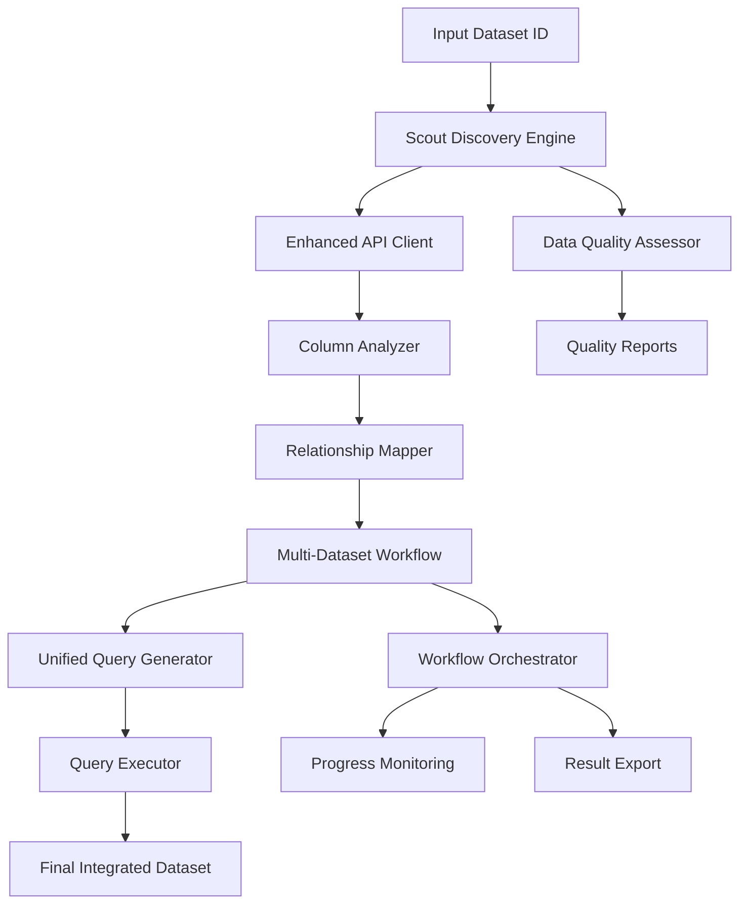

# Scout Data Discovery - Architecture Documentation

## Overview

Scout Data Discovery is a comprehensive Python package for automated data discovery, quality assessment, and multi-dataset integration. Built on the methodology pioneered by Scout (https://scout.tsdataclinic.com/), this package provides enterprise-grade tools for intelligent data discovery, relationship mapping, and unified querying across multiple datasets.

## Package Structure

```
scout_data_discovery/
├── __init__.py                     # Package initialization and exports
├── requirements.txt                # Python dependencies
├── README.md                      # Main package documentation
├── README_ARCHITECTURE.md         # This architecture guide
│
├── src/                           # Core source code
│   ├── scout_discovery.py         # Main Scout workflow orchestration
│   ├── data_quality.py           # Comprehensive data quality assessment
│   ├── enhanced_api_client.py    # Advanced NYC Open Data API client
│   ├── column_relationship_mapper.py  # Column analysis & relationship mapping
│   ├── multi_dataset_workflow.py     # Multi-dataset discovery workflow
│   ├── unified_query_executor.py     # Multi-dataset query execution engine
│   ├── workflow_orchestrator.py      # Complete workflow orchestration
│   └── exceptions.py                  # Custom exception hierarchy
│
├── config/                        # Configuration management
│   ├── default_config.yaml       # Default configuration settings
│   └── config_manager.py         # Configuration loading and validation
│
├── examples/                      # Usage examples and tutorials
│   ├── basic_usage.py            # Basic Scout functionality examples
│   ├── enhanced_api_examples.py  # Enhanced API client examples
│   └── multi_dataset_workflow_examples.py  # Complete workflow examples
│
├── tests/                         # Test suite
│   └── test_scout_discovery.py   # Comprehensive unit tests
│
└── logs/                         # Log files (created at runtime)
    └── (runtime log files)
```

## Core Components

### 1. Main Discovery Engine (`src/`)

**Purpose**: Contains the core intelligence and processing engines for data discovery and analysis.

- **scout_discovery.py**: Primary workflow orchestrator integrating all components
- **data_quality.py**: Multi-dimensional data quality assessment engine
- **enhanced_api_client.py**: Advanced Socrata API client with SoQL capabilities
- **column_relationship_mapper.py**: Intelligent column analysis and relationship detection
- **multi_dataset_workflow.py**: Multi-dataset discovery and query generation
- **unified_query_executor.py**: Optimized multi-dataset query execution
- **workflow_orchestrator.py**: Complete end-to-end workflow coordination
- **exceptions.py**: Structured error handling and custom exceptions

### 2. Configuration System (`config/`)

**Purpose**: Centralized configuration management with validation and environment support.

- **default_config.yaml**: Production-ready default settings
- **config_manager.py**: Hierarchical configuration loading (defaults → user → environment)

### 3. Examples & Tutorials (`examples/`)

**Purpose**: Comprehensive examples demonstrating all features and use cases.

- **basic_usage.py**: Getting started with core Scout functionality
- **enhanced_api_examples.py**: Advanced API features and SoQL queries
- **multi_dataset_workflow_examples.py**: Complete multi-dataset workflows

### 4. Test Suite (`tests/`)

**Purpose**: Comprehensive testing with mocks for external dependencies.

- **test_scout_discovery.py**: Unit tests, integration tests, and error condition testing

### 5. Runtime Resources (`logs/`)

**Purpose**: Runtime-generated files for monitoring and debugging.

- Log files with configurable levels and rotation
- Execution statistics and performance metrics

## Data Flow Architecture



## Key Capabilities

### 🔍 **Intelligent Discovery**
- Semantic dataset search using Scout methodology
- Quality-based filtering and ranking
- Related dataset recommendations
- Cross-portal dataset discovery

### 📊 **Advanced Quality Assessment**
- 5-dimensional quality scoring (completeness, consistency, accuracy, timeliness, usability)
- Automated outlier detection and data validation
- Missing data pattern analysis
- Data type optimization recommendations

### 🔗 **Column Relationship Mapping**
- 15+ data type detection (dates, addresses, coordinates, IDs, etc.)
- 9 relationship types (exact_match, semantic_match, hierarchical, geographic, etc.)
- Confidence scoring and join potential assessment
- Cross-dataset schema alignment

### ⚡ **High-Performance Processing**
- Dual backend support (pandas/Polars)
- Streaming for large datasets
- Parallel processing and batch operations
- Intelligent caching and rate limiting

### 🎯 **Unified Query System**
- JSON-serializable multi-dataset queries
- Advanced SoQL query building
- Intelligent join optimization
- Execution plan generation and cost estimation

### 🔄 **Workflow Orchestration**
- End-to-end workflow automation
- Step-by-step progress tracking
- Callback system for monitoring
- Automatic result export and archiving

## Integration Points

### External APIs
- **Socrata Discovery API**: Dataset search and metadata
- **NYC Open Data API**: Primary data source with SoQL support
- **Scout Platform**: Methodology and quality assessment principles

### Data Backends
- **Pandas**: Default data processing backend
- **Polars**: High-performance alternative (optional)
- **File Formats**: CSV, JSON, Parquet, Excel export support

### Configuration Sources
- **YAML Files**: Human-readable configuration
- **Environment Variables**: Runtime configuration overrides
- **Direct API**: Programmatic configuration

## Scalability & Performance

### Memory Management
- Configurable sample sizes for large datasets
- Streaming processing for memory efficiency
- Intelligent chunk sizing based on available resources

### Concurrency
- Parallel dataset fetching
- Multi-threaded quality assessment
- Asynchronous operations where applicable

### Caching Strategy
- Response caching with TTL
- Schema caching for repeated analysis
- Query result caching with invalidation

### Rate Limiting
- Configurable delays between API requests
- Exponential backoff for failed requests
- Respectful API usage patterns

## Extension Points

### Custom Quality Metrics
- Pluggable quality assessment modules
- Custom scoring algorithms
- Domain-specific validation rules

### Additional Data Sources
- New API client implementations
- Custom data connectors
- Multi-platform support

### Workflow Customization
- Custom step implementations
- Plugin architecture for new capabilities
- Event-driven processing hooks

## Security & Compliance

### Data Privacy
- Metadata-only processing by default
- Configurable data sampling limits
- No persistent storage of sensitive data

### API Security
- Secure credential management
- Rate limiting and abuse prevention
- Audit logging for all operations

### Error Handling
- Graceful degradation strategies
- Comprehensive error logging
- Secure error message sanitization

## Deployment Considerations

### Dependencies
- Core: pandas, numpy, requests, PyYAML
- Optional: polars (high-performance), aiohttp (async)
- Development: pytest, black, flake8

### Environment Requirements
- Python 3.8+
- Memory: 2GB+ recommended for large datasets
- Network: Stable internet for API access

### Configuration
- Environment-specific config files
- Secrets management integration
- Monitoring and alerting setup

This architecture provides a robust, scalable foundation for data discovery and integration workflows while maintaining flexibility for customization and extension.